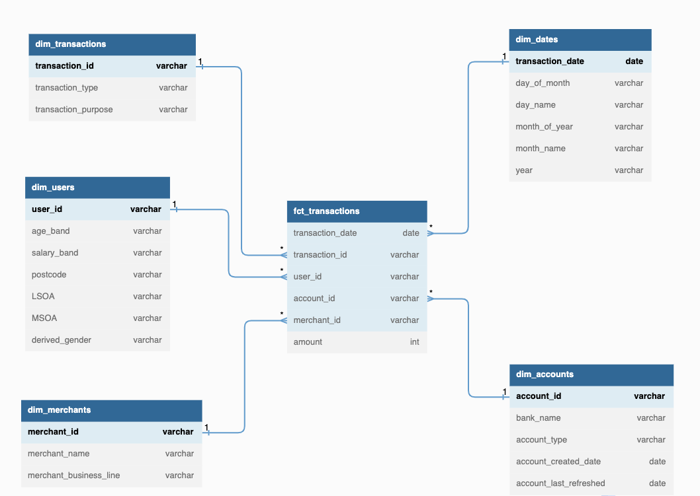

This repo contains my series of tutorial and practice in dimensional data modeling.
- <a href="https://github.com/Balurc/data_modeling/blob/main/dimensional_model/basic_star_schema.sql">Basic Star Schema</a> and the accompanying <a href="https://medium.com/@baluramachandra90/implementing-star-schema-in-snowflake-data-warehouse-1f890cdda952">article</a>

